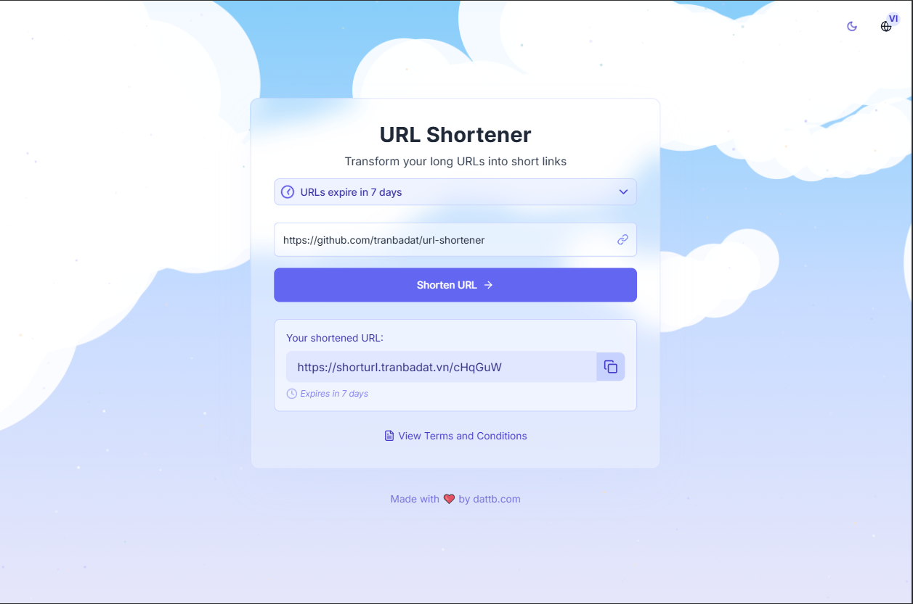
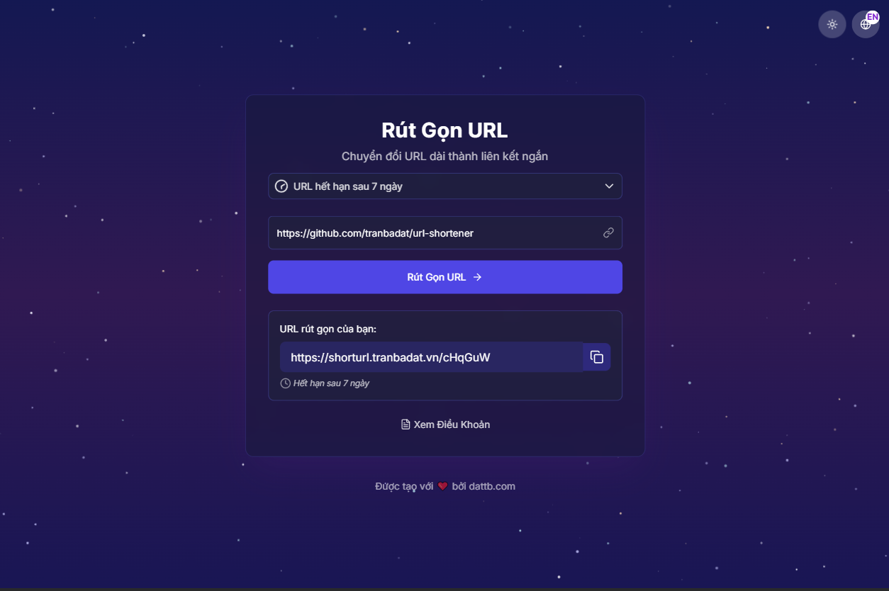

# 🔗 URL Shortener – Full Stack Project

A modern URL shortener application with analytics, custom aliases, and expiration support.  
Built using **Java Spring Boot** for the backend, **Next.js** for the frontend, and **PostgreSQL** for data storage. Dockerized for easy deployment.

🌐 **Live Demo**: [https://shorturl.tranbadat.vn](https://shorturl.tranbadat.vn)

---

## 📁 Project Structure

```
url-shortener/
├── url-shortener-be/        # Spring Boot backend API
├── url-shortener-fe/       # Next.js frontend
├── resources/      # Demo images (image1.png, image2.png)
├── docker-compose.yml
└── README.md
```

---

## 🧱 Tech Stack

| Layer     | Technology       |
|-----------|------------------|
| Frontend  | Next.js (React)  |
| Backend   | Java Spring Boot |
| Database  | PostgreSQL       |
| DevOps    | Docker Compose   |

---

## 🖼️ UI Preview

Home page and core features:

<p float="left">
  
  
</p>

---

## 🚀 Getting Started

### 1. Clone the Repository

```bash
git clone https://github.com/tranbadat/url-shortener.git
cd url-shortener
```

### 2. Start with Docker Compose

```bash
docker-compose up --build
```

- Frontend: [http://localhost:3000](http://localhost:3000)  
- Backend API: [http://localhost:8080](http://localhost:8080)

---

## 🔙 Backend – Spring Boot API

Handles shortening, redirection, and click tracking.

### 🧱 Stack

- Java 17
- Spring Boot 2.7+
- PostgreSQL
- JPA (Hibernate)
- RESTful API

### 🔌 API Endpoints

Base API: `http://localhost:8080/v1/short-url`

| Method | Endpoint               | Description               |
|--------|------------------------|---------------------------|
| POST   | /shorten               | Create a short URL        |
| GET    | /lookup/{shortCode}   | Redirect to original URL  |
| GET    | /api/stats/{code}     | Get click statistics      |

### ▶️ Run Backend Locally

```bash
cd url-shortener-be
./gradlew bootRun
```

#### Configuration (in `application.yml`)

```yaml
spring:
  datasource:
    url: jdbc:postgresql://localhost:5432/short-url
    username: dattb
    password: dattb123
```

### 🧪 Run Backend Tests

```bash
./gradlew test
```

---

## 🖼️ Frontend – Next.js App

Frontend interface for creating short links and tracking usage.

### 🧱 Stack

- Next.js (React)
- Tailwind CSS
- Axios

### ✨ Features

- Input long URLs to generate short links
- Support for custom aliases
- Show click statistics
- Copy-to-clipboard functionality
- Fully responsive UI

### ▶️ Run Frontend Locally

```bash
cd url-shortener-fe
npm install
npm run dev
```

Frontend available at: [http://localhost:3000](http://localhost:3000)

### 🌐 API Configuration

Create a `.env.local` file in the `frontend/` directory:

```env
NEXT_PUBLIC_API_BASE_URL=http://localhost:8080
```

---

## 🐳 Dockerized Setup

Make sure Docker is installed, then from the project root:

```bash
docker-compose up --build
```

This will start:

- 🧠 Spring Boot backend at `http://localhost:8080`
- 🌐 Next.js frontend at `http://localhost:3000`
- 🐘 PostgreSQL database on port `5432`

---

## 🤝 Contributing

Contributions are welcome!  
Fork the repository, create a new branch, and submit a pull request.

---

## 📄 License

MIT License – See [LICENSE](./LICENSE)